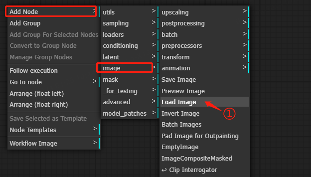
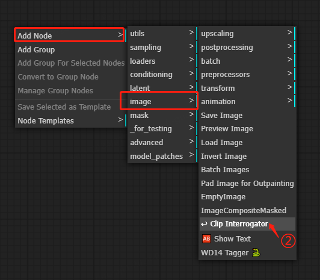
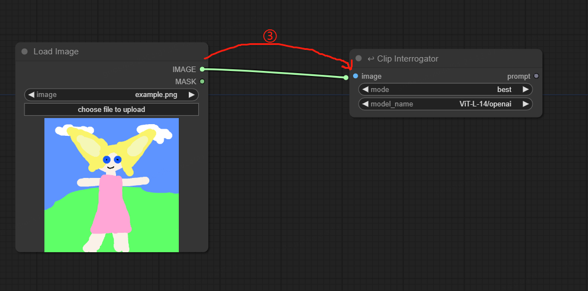
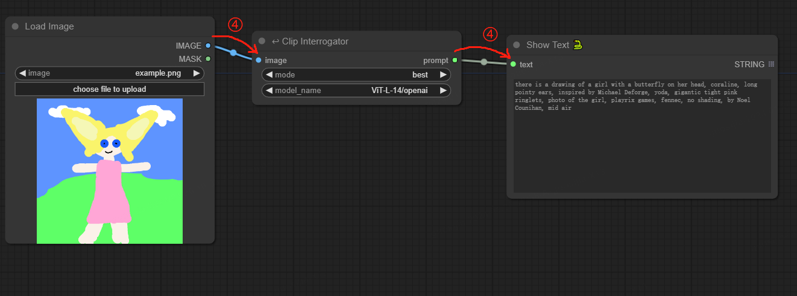

#### English | [中文](./README_zh.md)
**Not Finished**

# ComfyUI-clip-interrogator
Unofficial ComfyUI extension of clip-interrogator

_Be free to open issues_

_Highly recommended to review `README_zh.md` if you're a Chinese developer_

### Install
- Please install pythongosssss/ComfyUI-Custom-Scripts first: `https://github.com/pythongosssss/ComfyUI-Custom-Scripts`
- `cd` to `custom_nodes/` under the ComfyUI project folder: `cd  path/to/ComfyUI/custom_nodes`
- git clone this repo: `git clone https://github.com/unanan/ComfyUI-clip-interrogator.git`
- `cd` into `ComfyUI-clip-interrogator/`: `cd path/to/ComfyUI/custom_nodes/ComfyUI-clip-interrogator`
- Run `python install.py`

### Usage

### TODOs
[] share weights in A1111/stable-diffusion-webui
